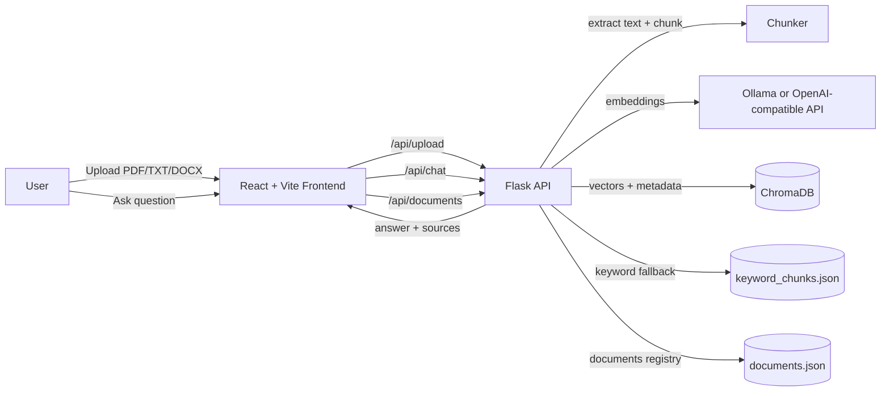

# RAG Chat Workspace


A lightweight **RAG (Retrieval-Augmented Generation)** workspace with a ChatGPT-style UI:
- Upload documents (PDF/TXT/DOCX) → chunk + embed → store in **Chroma**
- Chat with **one document**, **multiple selected documents**, or **all documents**
- Manage a **Document Library** (list / set active / delete)
- Show sources (snippets + chunk metadata)
- Optional local auth (session cookie), easy to disable for demos
- Paste images into the chat composer (Ctrl+V) for quick sharing (frontend preview + message attachment)

---

## Fun visuals (because README should not be boring)


> Add your own screenshots here (recommended):
>
> - `docs/screenshots/library.png`
> - `docs/screenshots/chat.png`
>
> Then embed them:
>
> ``

---

## Architecture



---

## Features

### Document Library (the “most valuable” upgrade)
- **List uploaded documents** with metadata
- **Set active document** (session-scoped)
- **Delete a document** (file + vector index + keyword index + registry record)
- **Chat scope selector**:
  - **Active**: use the current active doc
  - **Selected**: tick multiple docs
  - **All**: search across the whole library

### Chat modes (current behavior)
- If there is **no active document**, chat falls back to **freeform** answer
- If RAG retrieval fails or the LLM refuses, the backend falls back to an **extractive answer from retrieved context**

---

## API endpoints (backend)

- `GET /api/health`
  - Returns backend status + `llm_backend_reachable`
- `POST /api/upload`
  - Upload a document, extract text, chunk, embed, index
- `GET /api/documents`
  - List documents + current `active_document`
- `POST /api/documents/active`
  - Set active document: `{ "filename": "..." }`
- `DELETE /api/documents/<filename>`
  - Delete document and indexes
- `POST /api/chat`
  - Body:
    - `question` (string)
    - `document_mode`: `"active" | "selected" | "all"`
    - `selected_documents`: `string[]` (when mode = `selected`)

---

## Quick start (Windows / PowerShell)

### 1) Start Ollama (recommended for local demos)

Install Ollama for Windows, then pull models:

```powershell
ollama pull nomic-embed-text
ollama pull llama3.2
```

### 2) Backend (Flask)

From `rag-app/backend`:

```powershell
python -m venv .venv
.\.venv\Scripts\Activate.ps1
pip install -r requirements.txt
python run.py
```

Backend defaults to `http://127.0.0.1:5000`.

### 3) Frontend (Vite + React)

From `rag-app/frontend`:

```powershell
npm install
npm run dev
```

Then open the local URL shown by Vite (usually `http://localhost:5173` or the next available port).

---

## Configuration

Backend config lives in `rag-app/backend/.env` (optional).

### Local Ollama (default)

```env
# OPENAI_BASE_URL=http://127.0.0.1:11434/v1
EMBEDDING_MODEL=nomic-embed-text
CHAT_MODEL=llama3.2

# Optional tuning:
# LLM_PROBE_TIMEOUT_SEC=15
# CHAT_COMPLETION_TIMEOUT_SEC=120
# CHAT_MAX_TOKENS=384
# RAG_MAX_CONTEXT_CHARS=6000
```

### Index replacement

By default, new uploads **do not wipe** old documents.

To restore the old behavior (replace the whole index on each upload):

```env
REPLACE_INDEX_ON_UPLOAD=true
```

---

## Troubleshooting

### Windows error 10061 / connection refused
Ollama is not running yet. Start the Ollama app or run `ollama serve`, then re-check:
- `GET http://127.0.0.1:5000/api/health`

### Slow first response
The first chat call may be slow because Ollama is loading the model into RAM.
Try smaller models (example: `llama3.2:1b`) and tune:
- `CHAT_MAX_TOKENS`
- `RAG_MAX_CONTEXT_CHARS`

---

## License

MIT — see [`LICENSE`](../LICENSE).
